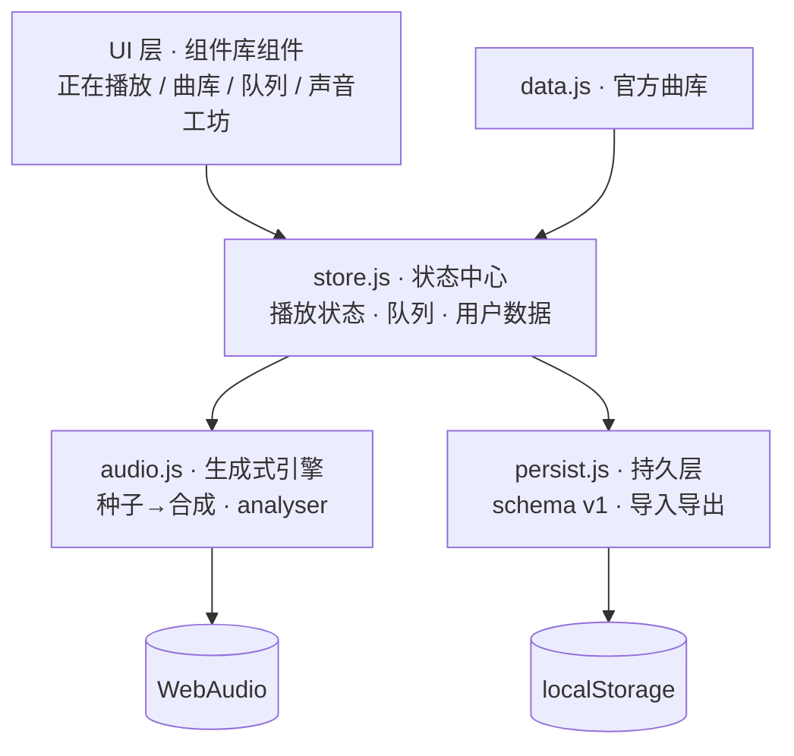

# SONA · 流声 — 技术架构文档

> 版本 v1.0 · 配套文档:`DESIGN.md`(产品规格)、`ROADMAP.md`(实现路径)

## 1. 定位与质量目标

SONA 是一个**生成式音乐播放器**:曲目由确定性种子实时合成,无音频文件、
无版权负担、可无限扩展曲库。"可盈利水平"在本项目中定义为以下可验收的
生产级质量清单:

| 维度 | 验收标准 |
| --- | --- |
| 稳定性 | 全流程零控制台错误;所有异步竞态有守卫;刷新/断网不丢用户数据 |
| 性能 | 首屏可交互 < 1s(本地);动画稳定 60fps;音频调度无爆音 |
| 可访问性 | 键盘全覆盖;WCAG AA 对比度;屏幕阅读器可用;reduced-motion 完整降级 |
| 数据安全 | 用户数据带 schema 版本号;导出/导入自救通道;写入失败有提示 |
| 视觉品质 | 明暗双主题;设计令牌一致;经独立视觉审查确认 |
| 可验证性 | Playwright E2E 覆盖核心路径;多智能体对抗审查通过 |

## 2. 技术栈与决策记录

| 决策 | 选择 | 理由 |
| --- | --- | --- |
| UI 层 | **跟随组件库**(等待其落地) | 本项目双重目标之一是验收组件库;若为 Web Components 直接引入,若为 React/Vue 则用 Vite 装配 |
| 音频层 | 原生 WebAudio,零依赖(已完成) | 生成式合成是产品核心壁垒;`audio.js` 框架无关,已通过无头频谱验证 |
| 状态层 | 自研微型 store(发布-订阅,< 60 行) | 单页应用规模不需要引框架;保持零依赖底色 |
| 持久层 | localStorage(v1)→ IndexedDB(曲目数超 500 时演进) | 用户歌单/自定义曲目数据量小;schema 版本化保证可迁移 |
| 构建 | 尽量免构建;组件库若需构建则 Vite | 降低复制成本,"clone 即运行" |

## 3. 模块架构



**依赖方向单向**:UI → Store → Engine/Persist。UI 不直接触碰引擎,
所有播放动作经 store 的 action 分发,保证迷你条/正在播放/列表行三处
播放状态永远一致。

## 4. 数据模型(schema v1)

```js
// 官方曲目(data.js,只读)
Track    { id, title, artist, album, dur, hue, seed, mood,
           lyrics: [{ t, line }] }   // 时间戳诗行,驱动重力歌词页

// 用户自定义曲目(声音工坊产物)—— 与官方曲目同构,id 前缀 'u'
// lyrics 可选:工坊从种子化诗行模板池自动生成,用户可改
UserTrack{ id: 'u<ts>', title, artist: '我', dur, hue, seed, mood,
           lyrics?, createdAt }

// 用户歌单
Playlist { id: 'up<ts>', name, desc, hue, trackIds: [], createdAt, updatedAt }

// 播放器状态(会话恢复)
PlayerState { queue: [], index, shuffle, repeat: 'off'|'all'|'one', volume }

// localStorage 键位
sona.v1.playlists   // Playlist[]
sona.v1.tracks      // UserTrack[]
sona.v1.player      // PlayerState
sona.v1.meta        // { schema: 1 }
```

**迁移策略**:启动时读 `sona.v1.meta.schema`;高于当前支持版本 → 只读
模式并提示升级;低于 → 逐版本迁移函数链。**写入失败**(隐私模式/配额):
Toast 明示"本次更改不会被保存",功能不阻断。

**导入导出**:`{ schema: 1, playlists, tracks }` 单 JSON 文件;导入时
逐条校验字段与类型,冲突 id 重新生成,非法条目跳过并汇报计数。

## 5. 播放内核(已实现,见 audio.js)

- **确定性**:`hashRand(seed, bar, step, salt)` 使跳转/回放完全可重现
- **调度**:40ms tick + 160ms lookahead(Chris Wilson 模式);
  暂停/跳转通过 segment gain 淡出销毁,无爆音
- **音色分层**:pad(双失谐锯齿+低通)/ 五声琶音 / 贝斯 / 鼓组(按
  mood 启用),经压缩器 + 反馈延迟空间
- **对外**:`load/play/pause/toggle/seek/setVolume/getTime/getAnalyser/onEnded`
- **扩展点**:声音工坊只需构造 `{ seed, mood, dur, hue }` 即得新曲目,
  引擎无需改动

## 6. 状态管理

```js
store = createStore({
  player: { trackId, playing, queue, index, shuffle, repeat, volume },
  library: { userTracks, userPlaylists },
  ui: { view, modal, toast },
})
// action 白名单:playTrack, togglePlay, seek, next, prev, setShuffle,
// setRepeat, setVolume, queueAdd/Remove/Reorder, playlistCreate/Rename/
// Delete/AddTrack/RemoveTrack/Reorder, trackForge(声音工坊), importData…
```

订阅粒度到路径(如 `player.playing`),避免整树重渲。持久化 action 在
微任务尾部合并写入(防抖 300ms)。

## 7. 性能预算

- 首屏:惰性初始化 AudioContext(首次手势),曲库列表虚拟化阈值 200 行
- 动画:仅 transform/opacity;频谱可视化单 canvas、rAF 与页面共享节流,
  隐藏 Tab 时挂起(`visibilitychange`)
- 内存:音频节点全部限时 `stop()`,segment 销毁即断链;长播 30 分钟
  节点数恒定(E2E 断言)

## 8. 可访问性

- 全部交互可键盘完成;Space 播放/暂停、←/→ 跳转、↑/↓ 音量(非输入焦点时)
- Slider 用组件库实现并验证 `aria-valuenow/-min/-max` 与方向键
- 播放状态变化经 `aria-live=polite` 播报;Modal 焦点圈闭与还原
- 频谱可视化纯装饰,`aria-hidden`;reduced-motion 下静态化

## 9. 商业化技术预留(明确边界)

**静态版可承载**(本仓库范围):
- 免费层/高级层 **feature flag 机制**(`flags.js`,本地判定):
  免费层 3 个自定义曲目 + 2 个歌单上限,高级层无限(演示用开关)
- 高级主题包(令牌层换肤,已具备条件)

**需要后端才能真实盈利**(超出本仓库,文档立此存照):
账号体系、支付(需服务端校验)、云同步、多端漫游、真实曲库授权。
架构上 persist 层已隔离——将来把 localStorage 适配器换成 API 适配器
即可,store 与 UI 无需改动。

## 10. 质量门

1. 单元级:引擎无头频谱验证(已通过,见 git 历史)
2. E2E(Playwright):播放链路 / 歌单 CRUD / 声音工坊 / 导入导出 /
   持久化刷新恢复 / 键盘全流程 / 双主题截图
3. 多智能体对抗审查(正确性 / 可访问性 / 视觉 / 产品四镜头)
4. 组件库验收反馈沉淀至 `FEEDBACK.md`
